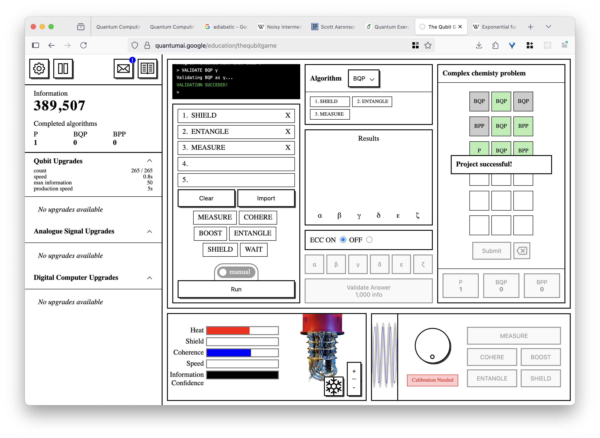
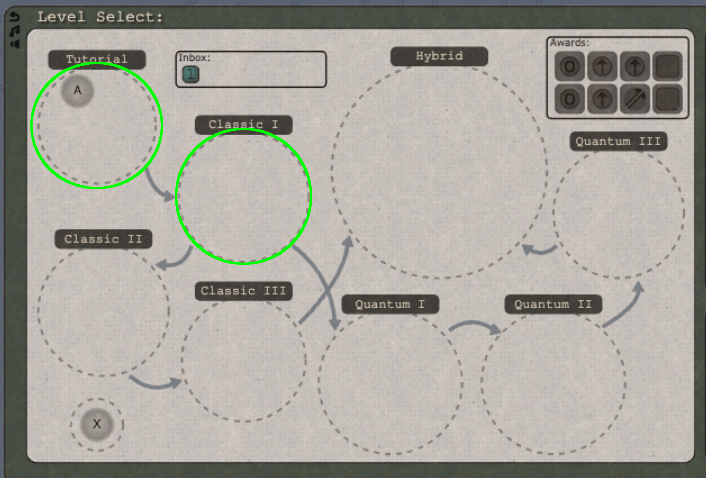

# Homework 1

## Exercise 1: Google Quantum AI's Qubit Game (10 pts)

We'll start off with some games! Google Quantum AI's Qubit Game is not particularly
challenging, but it provides a nice, interactive overview of some of the
key topics in quantum computing.

For Homework 1, you'll play the Qubit Game, which can be found here:

[https://quantumai.google/education/thequbitgame](https://quantumai.google/education/thequbitgame)

To meet the criteria for this exercise, you'll play for a while and provide a screenshot of
your game. You should play at least as far as solving a "complex chemistry problem" as shown in
the screenshot (but you can certainly play further to discover some amusing Easter eggs):



## Exercise 2: The Qubit Factory Game (up to 130 pts)

Another game! This one is a puzzle game that will demand a bit more thought.
You'll find The Qubit Factory here:

[https://www.qubitfactory.io](https://www.qubitfactory.io/)

An in-depth description of the game and instructions for playing can be found [here](https://arxiv.org/pdf/2406.11995).

Over the course of our class, you will actually make your way through all of the Classic and Quantum
puzzles in this game (the Hybrid puzzles will be extra credit). The puzzles in this game are a great
way to develop intuition in both classical and quantum logic.

For HW 1, you'll complete puzzles A through F of the Tutorial section and A through G of the Classic I section
(that is, all of Tutorial and Classic I) as highlighted by the green circles here:




For the Qubit Factory puzzle exercises, you will get 9 points out of 10 for successfully completing each puzzle,
and 10 out of 10 for completing the puzzle with a *gold star*. You can find out what the requirement is for the
gold star on each puzzle by checking the "Star Bonus" text in the "Level Status" area of the game, highlighted in
the screenshot:


Note that the simulator must be running to see the Star Bonus text. In some of the puzzles (such as the Tutorial
one shown above) the Star Bonus is a freebie and you get a gold star automatically. In others, getting the
gold star may be considerably more difficult than simply successfully completing the puzzle.

### Walkthroughs

Many of these first few Qubit Factory puzzles will probably be pretty easy. However, as the game progresses
they will get more challenging. If you find yourself stumped, you can always check the walkthrough solutions posted
by the creator (linked from the top page of the game). Please spend at least 20 minutes trying to solve each
puzzle before referring to a walkthrough solution, but don't spin your wheels endlessly. The walkthroughs
do not usually cover the Star Bonus requirement.

## Exercise 3: Getting Started with LaTeX (10 pts)

In this class some homework exercises will be carried out in LaTeX. LaTeX is the standard for academic typesetting in computer science and other technical fields. (Nobody rights CS papers in MS Word.) LaTeX is an open-source academic/technical typesetting tool built upon the TeX tool set by Donald Knuth (the guy who introduced Big-O notation to computer science and also defined Big-Theta and Big-Omega notation, among other significant accomplishments). We will use LaTeX for math homework because it enables readable, well-typeset math, and also has good support for technical graphics, including quantum circuits.

The homework starter `.tex` files will include examples of the kind of typesetting necessary to write the solutions. There is definitely a learning curve for LaTeX but once you get used to it you will find that for most technical writing it is far superior than most "what-you-see-is-what-you-get" (WYSIWYG) style editors like MS Word.

For this week's Exercise 3, read `main.tex` in the HW01 directory in the Homework repository and

## Submission and grading

All solution screenshots, code, and other files should be placed in the 'solution' directory in this directory.

For this assignment, submit the following:

* A screenshot of the Google Qubit Game in the stage you reached
* A screenshot of the Qubit Factory *Level Select* screen showing your stars
* A text (`.txt` or `.md`) file with your solutions for each exercise copy-pasted. To copy a solution in text format, press Ctrl-C over the main Quantum Factory puzzle area. You can then paste this in text form directly into a text file with Ctrl-V. A text-format solution can also be copy-pasted into the Quantum Factory puzzle editor. A text-format solution will look something like the code shown below. (Note that your progress through The Qubit Factory is stored in your browser. If your local browser storage gets cleared or if you use a different browser, your progress and puzzle solutions will no longer appear. You can still do puzzles, but this is one reason
why we need the solutions copy-pasted into a file for submission.):

  ```{"name":"T.A: Wired","tag":"tut1","version":"v1.1.7","tiles":[55,-1,-1,-1,-1,-1,-1,-1,-1,-1,-1,-1,-1,-1,-1,-1,-1,-1,75,21,-1,-1,-1,-1,-1,-1,-1,-1,-1,-1,-1,-1,-1,-1,-1,-1,-1,1,21,-1,-1,-1,-1,-1,-1,-1,-1,-1,-1,-1,-1,-1,-1,-1,-1,-1,1,21,-1,-1,-1,-1,-1,-1,-1,-1,-1,-1,-1,-1,-1,-1,-1,-1,-1,1,21,-1,-1,-1,-1,-1,-1,-1,-1,-1,-1,-1,-1,-1,-1,-1,-1,-1,1,23,22,22,22,22,22,22,22,25,-1,-1,-1,4,2,2,2,2,2,78,-1,-1,-1,-1,-1,-1,-1,-1,23,25,4,2,6,-1,-1,-1,-1,-1,-1,-1,-1,-1,-1,-1,-1,-1,-1,-1,23,12,25,-1,-1,-1,-1,-1,-1,-1,4,2,2,2,2,2,2,2,2,2,6,23,22,22,22,22,22,22,94,1,-1,-1,-1,-1,-1,-1,-1,-1,-1,-1,-1,-1,-1,-1,-1,-1,-1,21,1,-1,-1,-1,-1,-1,-1,-1,-1,-1,-1,-1,-1,-1,-1,-1,-1,-1,21,1,-1,-1,-1,-1,-1,-1,-1,-1,-1,-1,-1,-1,-1,-1,-1,-1,-1,21,1,-1,-1,-1,-1,-1,-1,-1,-1,-1,-1,-1,-1,-1,-1,-1,-1,-1,21,77,-1,-1,-1,-1,-1,-1,-1,-1,-1,-1,-1,-1,-1,-1,-1,-1,-1,57],"gates":[[0,0,"cCreate","free",1,0,0,1,9],[0,13,"qCreate","free",3,0,0,1,9],[18,13,"cCreate","free",3,0,0,2,9],[18,0,"qCreate","free",1,0,0,2,9],[18,8,"compare","free",3,0.785398163397,0,4,-1],[18,5,"qCompare","free",0,0.392699081699,0,2,-1]]}```.

* Your edited 'main.tex' from the LaTeX exercise
* Your generated 'main.pdf' file from the LaTeX exercise. Note that generateing the 'main.pdf' file will automatically generate two additional files, 'main.log' and 'main.aux'. You can disregard these files, and they will not be tracked by Git as they are included in this repo's '.gitignore' file.
